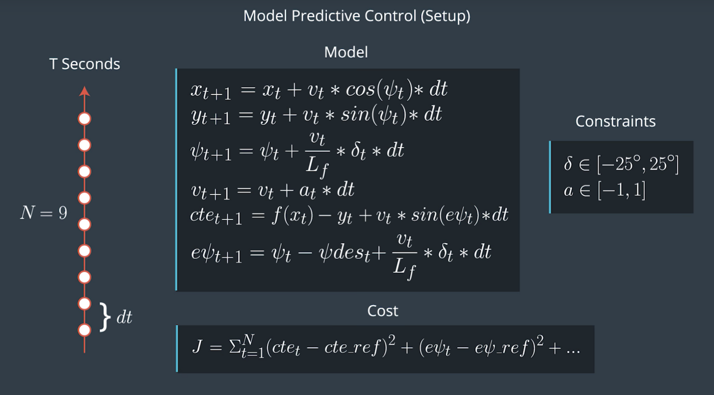

# Project 10: Model Predictive Control (MPC) Project

## 1. Introduction
MPC(Model Predictive Control) implemented in C++ to maneuver the vehicle around the track.

#### Model Predictive Control
- Model Predictive Control(MPC) reframes the task of following a trajectory as an optimization problem. The solution to the optimization problem is the optimal trajectory. MPC involves simulating different actuator inputs, predicting the resulting trajectory and selecting that trajectory with a minimum cost.

- Once the lowest cost trajectory found, the very first step of actuation commands would be implemented. Then the rest of the calculated trajectory would be thrown away and use the current state to calculate a new optimal trajectory.

  <div align="center">
    </a>
  </div>

#### Length and Duration
Assume `T` as the duration over which future predictions are made. `T` is the product of timestep `N` and time elapes between actuations `dt`.
- `N`: Because the car should run at 100 mph and as fast as possible at sharp turn so any futher predictions (more timesteps `N`)are not necessary.
- `dt`: The choice of `dt` is very tricky, the smaller `dt` the more costly computation. The larger `dt` the more space between each calculation which results in unexpected events occured.

In this project I chose `dt` as 0.1 and `N` as 10 which result the `T` value as 1 second.

#### Vehicle Model
MPC uses an optimizer to find the control inputs and minimize the cost function. At the very first step of control inputs, the new state of the vehicle as below updated and repeate the process of optimizer.

- **Model's Input**

  ```C++
  // values at timestep [t+1] based on values at timestep [t] after dt seconds
  // Lf is the distance between the front of the vehicle and the center of gravity

  x[t+1]    = x[t] + v[t] * cos(psi[t]) * dt;
  y[t+1]    = y[t] + v[t] * sin(psi[t]) * dt;
  psi[t+1]  = psi[t] + v[t]/Lf * delta[t] * dt;
  v[t+1]    = v[t] + a[t] * dt;
  cte[t+1]  = f(x[t]) - y[t] + v[t] * sin(epsi[t]) * dt;
  epsi[t+1] = psi[t] - psi_des + v[t]/Lf * delta[t] * dt;
  ```

  ```C++
  waypoints position on the track in global coordinates:
  - ptsx (x-position of waypoints ahead)
  - ptsy (y-position of waypoints ahead)

  current vehicle position, velocity, etc in global coordinates:
  - px    (x-position)
  - py    (y-position)
  - psi   (orientation angle)
  - v     (velocity)
  - delta (steering angle)
  - a     (throttle)
  ```

- **Transform waypoints to Car's frame**

  ```C++
  for (int i = 0; i < ptsx.size(); i++){

    //shift car reference angle to 90 degrees
    double shift_x = ptsx[i] - px;
    double shift_y = ptsy[i] - py;

    ptsx[i] = shift_x * cos(0-psi) - shift_y * sin(0-psi);
    ptsy[i] = shift_x * sin(0-psi) + shift_y * cos(0-psi);

  }
  ```

#### Cost Function

The cost of a trajectory of length N is the total of all following cost below:

 1. [*Reference State*] CTE   Cost
 1. [*Reference State*] EPSI  Cost
 1. [*Dealing with Stopping*] Speed Cost
 1. [*Combination*] **Combination of CTE & EPSI & Speed Cost**

        * This cost helps the car stick to reference path.
        * Increase its weight may slow down the car.
 1. [*Actuator*] Steering Cost
 1. [*Actuator*] Throttle Cost
 1. [*Combination*] **Combination of Steering & Speed Cost**

        * This cost helps the car slow down at sharp turn
        * Increase its weight may bring the car to halt
          like car stopping in sharp curves and after few seconds,
          it starts and continues
 1. [*Difference*] 2 Consecutive Steering Cost
 1. [*Difference*] 2 Consecutive Throttle Cost
 1. [*Combination*] **2 Consecutive Steering & Speed Cost**

        * Smooth the different steering value with speed
        * Increase its weight may cause green line zigzag

Each cost has its weights and relative weights were set up as below:
- `[2000, 2000, 1, 10, 5, 5, 50, 300, 10 ,50]`

  ```C++
  fg[0] = 0;

  // Relative weights [2000, 2000, 1, 10, 5, 5, 50, 300 ,10, 50]

  // Reference State cost
  for (int i = 0; i < N; i++){
    // CTE cost
    fg[0] += 2000*CppAD::pow(vars[cte_start +i]  - ref_cte, 2);
    // EPSI cost
    fg[0] += 2000*CppAD::pow(vars[epsi_start +i] - ref_epsi, 2);
    // Target Speed Cost
    fg[0] +=      CppAD::pow(vars[v_start +i]    - ref_v, 2);

    // Stick to the reference path by combining cost of CTE, EPSI
    // increase this may slow down the car
    fg[0] +=   10*CppAD::pow((vars[cte_start +i] - ref_cte)
                             * (vars[epsi_start +i] - ref_epsi)
                             *  vars[v_start+i], 2);

  }
  // Actuator cost values
  for(int i = 0; i < N - 1; i++){
    // Steering Cost
    fg[0] +=    5*CppAD::pow(vars[delta_start + i], 2);
    // Throttle Cost
    fg[0] +=    5*CppAD::pow(vars[a_start     + i], 2);

    // Sharp turn slow down, increase this may bring the car to halt
    // car stopping in sharp curves and after few seconds,
    // it starts and continues
    fg[0] +=   50*CppAD::pow(vars[delta_start + i]
                             * vars[delta_start + i]
                             * vars[v_start+i], 2);

  }
  // Steering angle cost values or Difference between 2 consecutive controls
  for (int i = 0; i < N -2; i++){
    fg[0] +=  300*CppAD::pow(vars[delta_start + i + 1] - vars[delta_start + i], 2);
    fg[0] +=   10*CppAD::pow(vars[a_start + i + 1]     - vars[a_start + i]    , 2);

    // Smooth the different steering value with Speed
    // Increase this may cause green line zigzag
    fg[0] +=   10*CppAD::pow((vars[delta_start + i + 1] - vars[delta_start + i])
                             * vars[v_start+i], 2);

  }
  ```

#### Latency
In a real car, an actuation command won't execute instantly - there will be a delay as the command propagates through the system. A realistic delay might be on the order of 100 milliseconds. As the result, the vehicle may react too late at tight turns and run-off the road. There are some solutions to deal with latency as below:
1. One solution is that increase the timesteps `N` and add more penalties for stearing cost. This requires adjusting relative weights carefully and hard to adapt globally.
1. Another solution is that calculating the current state with latency. This allow the vehicle look ahead and correct its position. I did not choose this method because it is exactly what MPC trying to do: **look ahead and predict**
1. My solution is that add more penalties by combining streering value and speed value. The more tight turn ahead, the more streeing value and the higher cost with velocity. The car could slow down before the turn.


## 2. Results

Youtube video recorded at 100 (mph). Click to view!
<div align="center">
  <a href="https://www.youtube.com/watch?v=KtUz8N7ea14"></a>
</div>


## 3. Set up environment
### Dependencies

* cmake >= 3.5
 * All OSes: [click here for installation instructions](https://cmake.org/install/)
* make >= 4.1(mac, linux), 3.81(Windows)
  * Linux: make is installed by default on most Linux distros
  * Mac: [install Xcode command line tools to get make](https://developer.apple.com/xcode/features/)
  * Windows: [Click here for installation instructions](http://gnuwin32.sourceforge.net/packages/make.htm)
* gcc/g++ >= 5.4
  * Linux: gcc / g++ is installed by default on most Linux distros
  * Mac: same deal as make - [install Xcode command line tools]((https://developer.apple.com/xcode/features/)
  * Windows: recommend using [MinGW](http://www.mingw.org/)
* [uWebSockets](https://github.com/uWebSockets/uWebSockets)
  * Run either `install-mac.sh` or `install-ubuntu.sh`.
  * If you install from source, checkout to commit `e94b6e1`, i.e.
    ```
    git clone https://github.com/uWebSockets/uWebSockets
    cd uWebSockets
    git checkout e94b6e1
    ```
    Some function signatures have changed in v0.14.x. See [this PR](https://github.com/udacity/CarND-MPC-Project/pull/3) for more details.

* **Ipopt and CppAD:** Please refer to [this document](https://github.com/udacity/CarND-MPC-Project/blob/master/install_Ipopt_CppAD.md) for installation instructions.
* [Eigen](http://eigen.tuxfamily.org/index.php?title=Main_Page). This is already part of the repo so you shouldn't have to worry about it.
* Simulator. You can download these from the [releases tab](https://github.com/udacity/self-driving-car-sim/releases).
* Not a dependency but read the [DATA.md](./DATA.md) for a description of the data sent back from the simulator.


### Basic Build Instructions
```
1. Clone this repo.
2. Make a build directory: `mkdir build && cd build`
3. Compile: `cmake .. && make`
4. Run it: `./mpc`.
```
### Tips

1. It's recommended to test the MPC on basic examples to see if your implementation behaves as desired. One possible example
is the vehicle starting offset of a straight line (reference). If the MPC implementation is correct, after some number of timesteps
(not too many) it should find and track the reference line.
2. The `lake_track_waypoints.csv` file has the waypoints of the lake track. You could use this to fit polynomials and points and see of how well your model tracks curve. NOTE: This file might be not completely in sync with the simulator so your solution should NOT depend on it.
3. For visualization this C++ [matplotlib wrapper](https://github.com/lava/matplotlib-cpp) could be helpful.
4.  Tips for setting up your environment are available [here](https://classroom.udacity.com/nanodegrees/nd013/parts/40f38239-66b6-46ec-ae68-03afd8a601c8/modules/0949fca6-b379-42af-a919-ee50aa304e6a/lessons/f758c44c-5e40-4e01-93b5-1a82aa4e044f/concepts/23d376c7-0195-4276-bdf0-e02f1f3c665d)
5. **VM Latency:** Some students have reported differences in behavior using VM's ostensibly a result of latency.  Please let us know if issues arise as a result of a VM environment.

### Editor Settings

We've purposefully kept editor configuration files out of this repo in order to
keep it as simple and environment agnostic as possible. However, we recommend
using the following settings:

* indent using spaces
* set tab width to 2 spaces (keeps the matrices in source code aligned)

### Code Style

Please (do your best to) stick to [Google's C++ style guide](https://google.github.io/styleguide/cppguide.html).

### Project Instructions and Rubric

Note: regardless of the changes you make, your project must be buildable using
cmake and make!

More information is only accessible by people who are already enrolled in Term 2
of CarND. If you are enrolled, see [the project page](https://classroom.udacity.com/nanodegrees/nd013/parts/40f38239-66b6-46ec-ae68-03afd8a601c8/modules/f1820894-8322-4bb3-81aa-b26b3c6dcbaf/lessons/b1ff3be0-c904-438e-aad3-2b5379f0e0c3/concepts/1a2255a0-e23c-44cf-8d41-39b8a3c8264a)
for instructions and the project rubric.

### Hints!

* You don't have to follow this directory structure, but if you do, your work
  will span all of the .cpp files here. Keep an eye out for TODOs.

### Call for IDE Profiles Pull Requests

Help your fellow students!

We decided to create Makefiles with cmake to keep this project as platform
agnostic as possible. Similarly, we omitted IDE profiles in order to we ensure
that students don't feel pressured to use one IDE or another.

However! I'd love to help people get up and running with their IDEs of choice.
If you've created a profile for an IDE that you think other students would
appreciate, we'd love to have you add the requisite profile files and
instructions to ide_profiles/. For example if you wanted to add a VS Code
profile, you'd add:

* /ide_profiles/vscode/.vscode
* /ide_profiles/vscode/README.md

The README should explain what the profile does, how to take advantage of it,
and how to install it.

Frankly, I've never been involved in a project with multiple IDE profiles
before. I believe the best way to handle this would be to keep them out of the
repo root to avoid clutter. My expectation is that most profiles will include
instructions to copy files to a new location to get picked up by the IDE, but
that's just a guess.

One last note here: regardless of the IDE used, every submitted project must
still be compilable with cmake and make./

### How to write a README
A well written README file can enhance your project and portfolio.  Develop your abilities to create professional README files by completing [this free course](https://www.udacity.com/course/writing-readmes--ud777).
